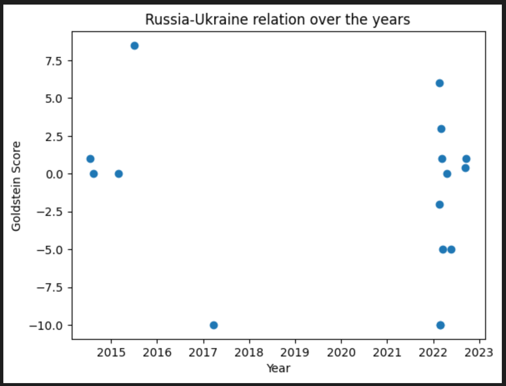

# Geopolitical Relations

This application extracts political entities from news articles, scores the extracted events between these political entities and plots them. News article extraction can be done from any Google News Category. These articles can be saved in JSON or CSV format. Petrarch API is used to extract triad political entities from the articles in the form of <actor1, event, actor2>. Actors consist of political entities such as countries. Events are CAMEO Codes. A mapping of CAMEO event codes to [-10,10] representing a scale of conflict and cooperation is performed. These Goldstein scores are plotted over the years for demonstration.

News Extraction:
- news_extraction_all_topics.py : Extracts news article details from all Google News Categories
- news_extraction_by_keyword.py : Extracts news article details from a given set of news websites given a keyword

Notebooks:
01. Collect Country Relations.ipynb : Uses Petrarch API and CoreNLP API to extract political entities from news articles
02. EDA.ipynb : Plots Goldstein score between two political entities over the years

Prerequisites:
- Start the Petrarch API docker container
- Start the CoreNLP API docker container

